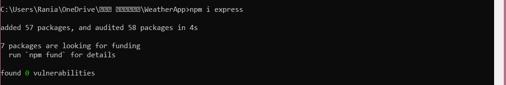
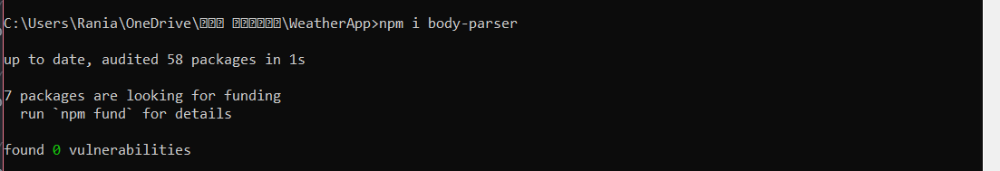

# Weather-Journal
Front End Web Developer ND program requirement

This project requires you to create an asynchronous web app that uses Web API and user data to dynamically update the UI for a Weather-Journal App.

## Node.js Steps: 
step 1: install express:

step 2: install bodyParser:

step 3: install cors

step 4: Node server.js ( to run the server)
 
## Refereces: 
- [Front End Web Developer ND course from Udacity]( https://www.udacity.com/course/front-end-web-developer-nanodegree--nd001)
- [npmjs](https://www.npmjs.com/package/cors)
- [bithacker website]([https://www.npmjs.com/package/cors](https://bithacker.dev/fetch-weather-openweathermap-api-javascript))
- [HTML & CSS book by Jon Duckett]([https://www.npmjs.com/package/cors](https://www.htmlandcssbook.com/code-samples/))
 
## API credentials:
- [OpenWeatherMap](https://www.OpenWeatherMap.com)

